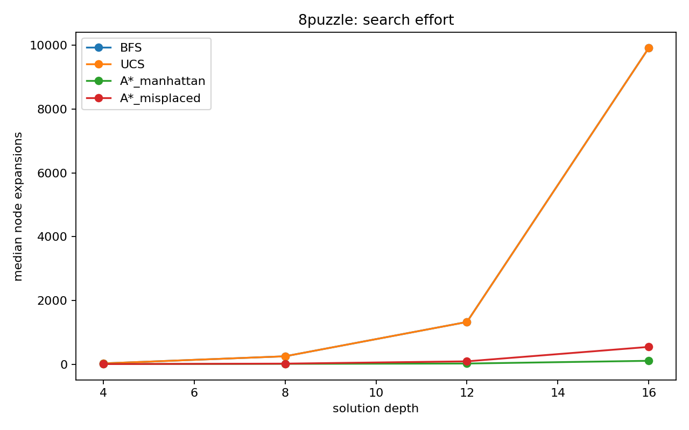
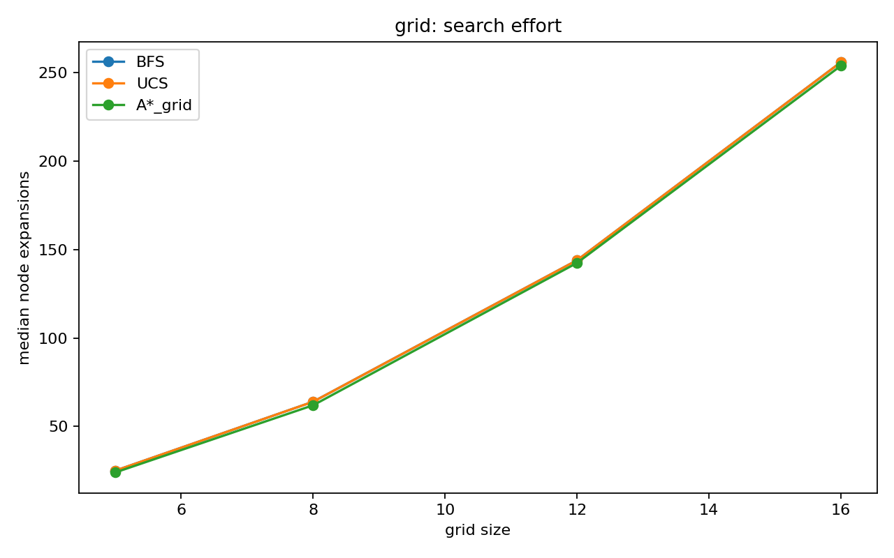
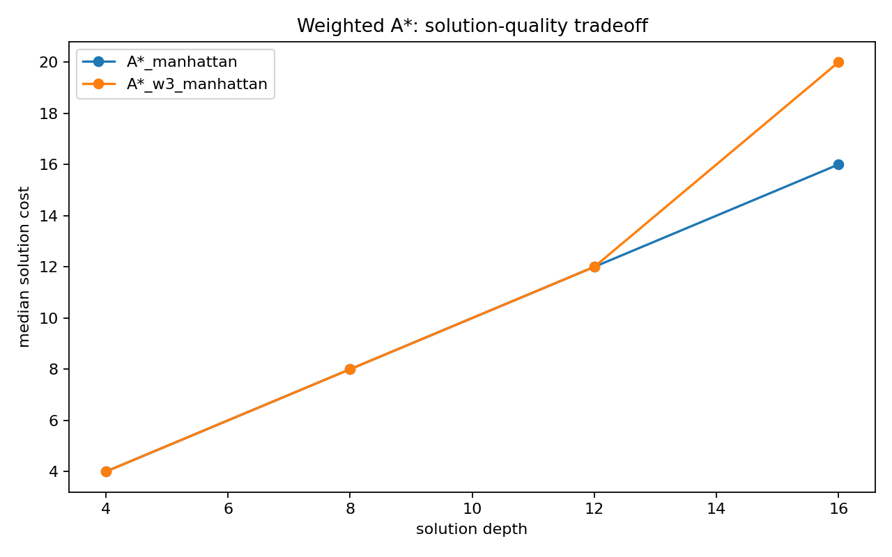
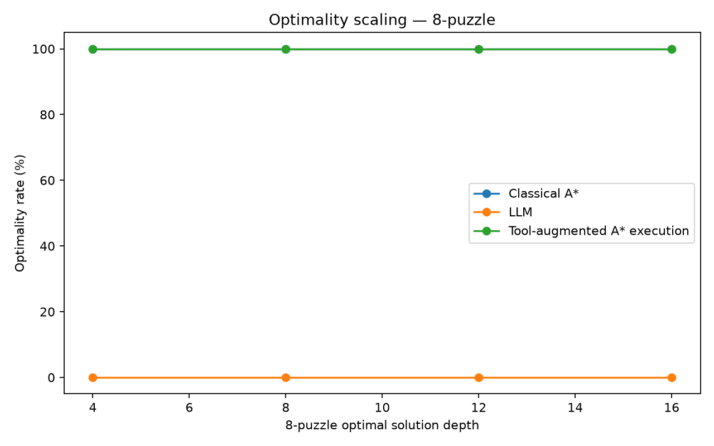
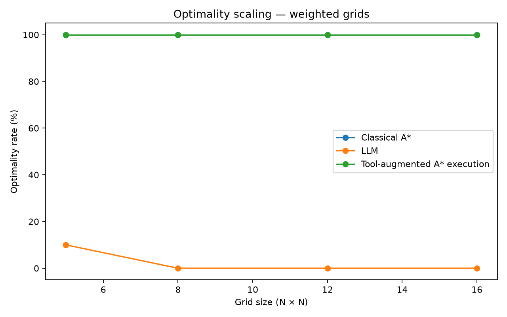

# Duel 1 — Search

## 1. Duel Scorecard

This experiment compares classical search, direct LLM generation, and a tool-augmented approach on the same 8-puzzle and weighted-grid instances.

| Axis | Classical | LLM | Tool-augmented |
|---|---|---|---|
| Procedure | BFS, DFS, UCS, IDS, A*, weighted A* | `qwen2.5:3b` generates a complete path | LLM emits a JSON A* tool call; our A* executes the search |
| Guarantee | UCS and admissible A* are optimal; BFS only under uniform costs | None | Search result inherits A* guarantee once the correct tool is invoked |
| Validation | Benchmark checks and reference comparisons | Independent validator checks legality, arithmetic cost, and optimality | Tool execution produces independently checkable A* paths |
| Reproducibility | Deterministic instances, seed and 5 s timeout | Raw transcripts stored in `.llm_cache/` | JSON tool interface tested with real model calls; 80 tool executions measured |
| Main result | Reliable exact search | 0/80 fully correct responses | A* tool solved 80/80 benchmark instances |

The main distinction is between generating a plausible answer and executing an explicit search procedure. Classical algorithms maintain state, frontier, and cost information. The direct LLM instead generates a candidate path. Tool augmentation delegates the exact search operation back to a deterministic algorithm.

## 2. Experimental Protocol

We tested two domains with four difficulty levels each. The 8-puzzle uses optimal solution depths 4, 8, 12, and 16. Weighted grids use sizes 5×5, 8×8, 12×12, and 16×16. Each level contains ten instances, giving 40 instances per domain.

Puzzle instances were selected at exact depths by breadth-first enumeration from the goal. Grid terrain costs are integers from 1 to 9 generated deterministically using seed `20261002`. Grid movement is four-directional and moving into a cell incurs that cell's terrain cost.

Classical measurements include solution cost, solution length, node expansions, maximum frontier, wall-clock time, and timeout status. The hard timeout was five seconds per algorithm-instance run. Results were summarized with medians and IQRs.

For the LLM arm, the same 80 instances were serialized and given to local `qwen2.5:3b` through Ollama. Raw responses were stored before validation. The validator, rather than the model, checked path legality, calculated actual cost, and compared it with an A* reference.

## 3. Classical Results

All tested classical runs completed within the five-second timeout.

*Figure 1. Median 8-puzzle expansions. More informative heuristic guidance reduces search effort as difficulty increases.*

*Figure 2. Median weighted-grid expansions. BFS minimizes steps rather than terrain cost and therefore does not provide the required minimum-cost guarantee.*

For all 40 8-puzzle instances, UCS and A* with Manhattan distance returned equal optimal costs. On weighted grids, BFS could be suboptimal because step costs are non-uniform. For example, grid 5×5 instance 0 produced BFS cost 31 versus UCS cost 26, although both paths contained eight moves.

Manhattan distance also demonstrated the required heuristic dominance over misplaced tiles: A* with Manhattan expanded no more nodes than misplaced-tiles on the tested puzzle instances. The estimated median effective branching factors for Manhattan were approximately 1.00, 1.08, 1.08, and 1.20 at depths 4, 8, 12, and 16. For misplaced tiles they were approximately 1.00, 1.18, 1.29, and 1.37.

### Breaking admissibility

We also evaluated weighted A* using `3 × Manhattan`.

At depth 4, it produced a 1.24× runtime speedup with no change in average solution cost. At depth 8, runtime improved by 1.31× and expansions fell 14.75%, again with no solution-quality loss.

At depth 12, however, the tradeoff became visible: runtime improved only 1.01×, expansions actually increased by 9.38%, and average solution cost rose from 12 to 12.2, a 1.67% increase.

At depth 16, weighted A* was 1.29× faster and reduced expansions by 19.35%, but average solution cost increased from 16 to 19, an 18.75% degradation.

*Figure 3. Breaking admissibility can reduce runtime or search effort, but the deeper instances show that this can sacrifice solution quality.*

Therefore, weighting the heuristic more aggressively is not an unconditional improvement: speed and optimality must be evaluated together.

## 4. Direct LLM Results

Across 80 real LLM calls, 72 responses (90%) were parseable. Only 17 (21.25%) contained legal paths.

The required failure categories were:

| Category | Count | Rate |
|---|---:|---:|
| Illegal path | 63 | 78.75% |
| Legal but suboptimal | 16 | 20.00% |
| Legal and optimal but incorrect reported cost | 1 | 1.25% |
| Fully correct | 0 | 0% |

All 40 8-puzzle responses were parseable, but none contained a completely legal path. Thus, correct JSON formatting did not imply correct state transitions.

The grid results were more nuanced. On 5×5 grids, 7/10 paths were legal. On 8×8 grids, all 10 paths were legal, but every one was suboptimal. At 12×12, none of the generated paths was legal. At 16×16, only 2/10 responses were parseable and none was legal.

One response deserves special attention. For grid 5×5 instance 8, the model generated a legal path whose actual cost was 28, equal to the A* optimum. However, the model reported the cost as 38. It therefore belongs to the required `legal and optimal but incorrect reported cost` category rather than being counted as fully correct.

This result illustrates why independent validation is necessary: even when the generated path itself is optimal, the model's arithmetic claim can still be wrong.

## 5. Reproducibility

Grid 5×5 instance 8 was submitted five times using an identical prompt. The experiment produced one distinct textual answer across the five calls.

The first call took approximately 34 seconds, while subsequent identical calls returned essentially immediately, indicating caching in the local LLM interface. Therefore, the observation establishes reproducibility of the accessed pipeline for this experiment, but it should not be interpreted as five statistically independent generations.

The transcripts and reproducibility record are retained in `.llm_cache/`.

## 6. Scaling and Tool Augmentation

*Figure 4. Optimality rate across puzzle depth. Direct LLM generation produced no optimal legal paths, while classical/tool A* remained optimal across the tested levels.*

*Figure 5. Grid optimality versus size. The direct LLM produced an optimal path on 10% of 5×5 instances and 0% at larger sizes; A* tool execution remained optimal across all tested sizes.*

For direct LLM generation, path optimality rates across puzzle depths were 0%, 0%, 0%, and 0%. For grids they were 10%, 0%, 0%, and 0%, where optimality here refers to the generated path itself; the single optimal path still had an incorrectly reported cost.

The tool-augmented interface was tested using real `qwen2.5:3b` calls in which the model correctly emitted the JSON request for the `astar` tool. We then benchmarked execution of that selected tool on all 80 instances. A* successfully solved all 80, giving 100% optimal tool-execution rate at every tested level.

These 80 rows measure execution after tool selection; they are not presented as 80 independent LLM inference calls. This distinction matters because the experiment supports the claim that delegating search to A* restores its algorithmic guarantees once the correct tool is selected, not that tool selection itself was independently tested 80 times.

## 7. Where We May Have Been Unfair

The classical side has an important advantage: its algorithms and heuristics were explicitly designed for these search domains. Manhattan distance, for example, embeds useful knowledge about the 8-puzzle. The direct LLM received an untuned textual prompt rather than an equivalently optimized prompting procedure.

The instance distribution may also favor explicit search. Exact puzzle depths and deterministic weighted grids naturally match algorithms that systematically enumerate states and costs.

Conversely, classical runtime excludes our development time. We measure execution after implementation, not the human effort required to implement BFS, UCS, A*, validators, and benchmark infrastructure. LLM inference similarly excludes the enormous upstream cost of training the model.

The tool-augmented measurement has an additional asymmetry: only a small number of real model tool-selection calls were performed before benchmarking A* execution on all 80 instances. Therefore, its 80/80 result measures the reliability of the invoked search tool, not an 80-trial estimate of LLM tool-selection accuracy.

These limitations should be considered when interpreting the duel.

## 8. What the Evidence Does Not Support

The results do not establish universal superiority of one paradigm. Ten instances per level characterize this benchmark distribution, not every possible puzzle or grid.

The poor direct-LLM results apply specifically to `qwen2.5:3b`, this prompt, and these instances. They do not imply that every language model would obtain the same rates. Likewise, performance at 16×16 says nothing experimentally established about size 20 or larger.

The tool experiment also does not demonstrate that an LLM will always choose the correct tool. It shows that real calls successfully produced the intended A* request in our interface and that, once invoked, the deterministic A* implementation solved all 80 benchmark instances.

## 9. Conclusion

The experiment shows that structured generation and algorithmic search are not equivalent. The LLM produced parseable output in 90% of trials, but 63 paths were illegal, 16 were legal but suboptimal, and the only optimal generated path reported the wrong cost. Consequently, none of the 80 direct responses satisfied all correctness criteria.

Classical search behaved differently because its guarantees follow from explicit procedures and assumptions. UCS and admissible A* agreed on optimal costs, while deliberately breaking admissibility demonstrated a measurable speed/quality tradeoff.

Tool augmentation provides a useful middle ground. The language model can express the intended operation, while deterministic A* performs the part requiring exact state transitions and cost optimization. In this experiment, once A* was selected, its tool executions solved all 80 benchmark instances optimally.

The evidence therefore supports using language models and classical algorithms for different roles: language models can provide flexible interaction and tool selection, while verified search procedures remain valuable when legality, arithmetic correctness, and optimality matter.