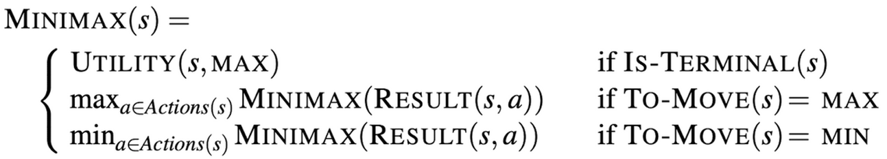
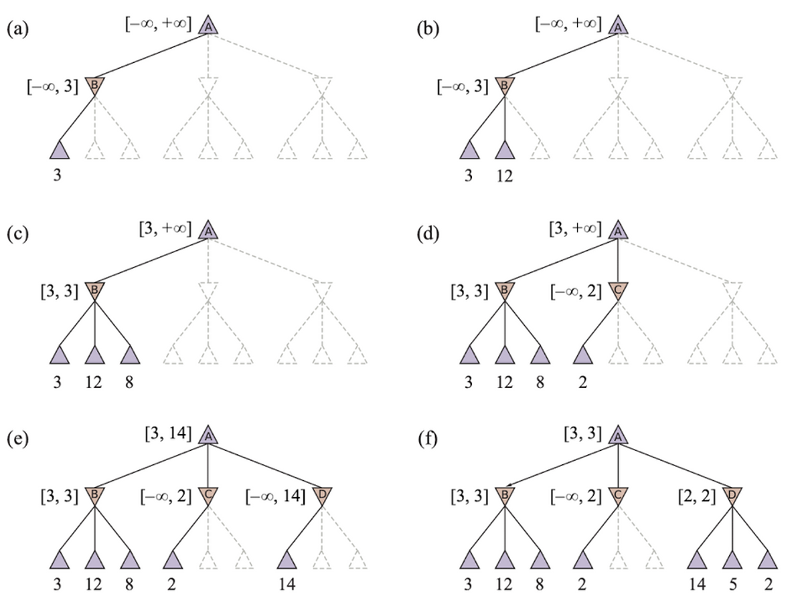
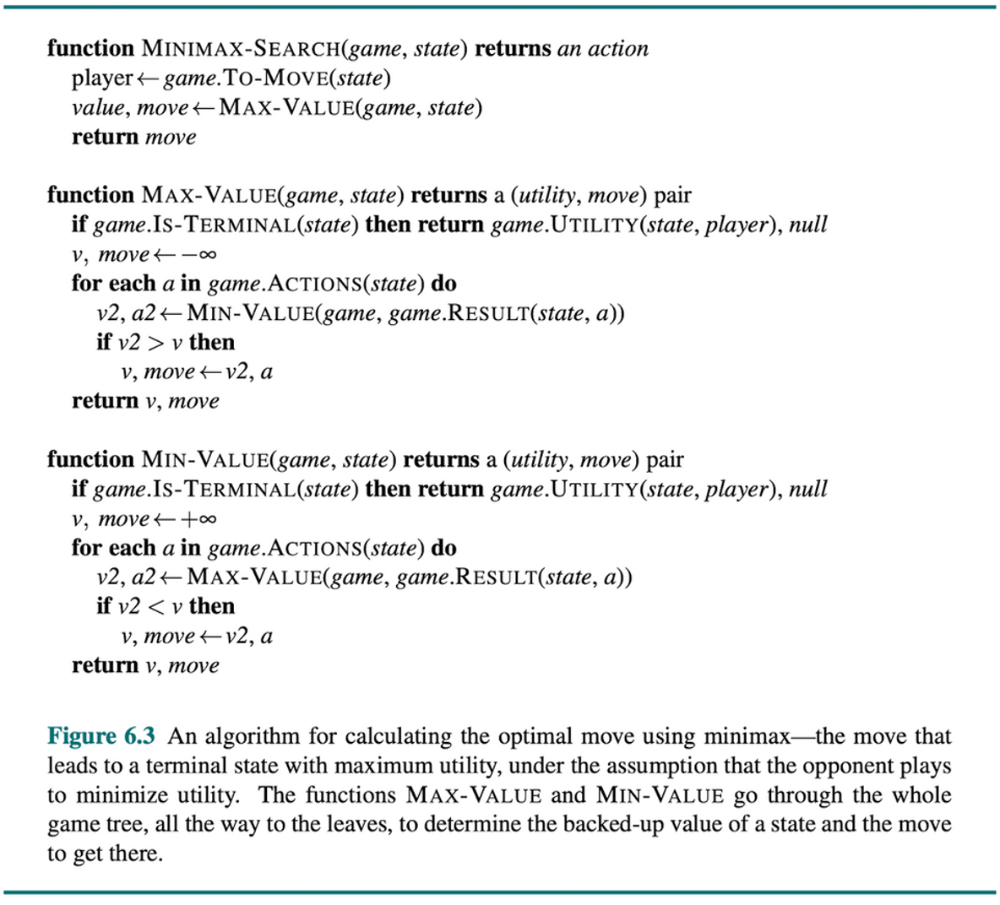

<!--
Week 5 Session A. Mini-lecture budget: 25 minutes.
Source: 02_Problem.pptx slides 17-22. Beats per lesson plan:
single→adversarial (3) → minimax (7) → alpha-beta (10) → eval/horizon (5).
Session B is the TOURNAMENT. Lesson plan: ../../weeks/week-05.md
-->

# Adversarial Search and Games

## When something is trying to make you lose

**CMP-4004** · Week 5


---

# From one agent to two

So far: **one agent** searching for a solution in a cooperative or neutral
environment.

In games: **two or more agents with opposing objectives.**

The problem is no longer finding a path to the goal. It is finding the **optimal
strategy** — while assuming the opponent also plays optimally.

### The assumptions we start with

- Two players: **MAX** and **MIN**
- **Zero-sum**: one player's gain is the other's loss
- **Perfect information**: fully observable
- **Deterministic**: no randomness

<!--
3 min. Name the shift precisely: the SOLUTION SHAPE changes. In weeks 3-4 a
solution was a sequence. Here it is a policy — contingent on what they do. That
is why you cannot just re-run A*.
-->

---

# Minimax



- **MAX** attempts to maximize the value of the final state
- **MIN** attempts to minimize that same value
- Assumes **both players play optimally**

The minimax value of a node, defined recursively:

```
minimax(s) = Utility(s)                          if Terminal(s)
           = max over a of minimax(Result(s,a))  if Player(s) = MAX
           = min over a of minimax(Result(s,a))  if Player(s) = MIN
```

Explores the **complete tree** down to terminal nodes.
Time **O(bᵐ)** · Space **O(b·m)**

---

# Minimax assumes a perfect opponent

That assumption is not free.

Against a **weak** opponent, minimax can be **suboptimal** — it will not set a
trap, because it assumes the trap would never be taken.

A move that wins 90 % of the time against real humans and loses to a perfect
player is invisible to minimax.

<!--
7 min for the two minimax slides. WORK A DEPTH-3 TREE BY HAND on the board with
the class calling out values. Do not skip it — students who have only seen the
formula cannot trace it, and Checkpoint 1 asks them to trace one.
The weak-opponent point takes a minute and is a genuine surprise.
-->

---

# α-β pruning


Minimax explores the entire tree, which is hopeless for real games.
**α-β eliminates branches that cannot influence the final decision.**

- **α** — best value found so far for MAX (a **lower** bound)
- **β** — best value found so far for MIN (an **upper** bound)

### Pruning rule

- If the value at a **MIN** node falls below **α** → prune
  *(MAX would never choose this path)*
- If the value at a **MAX** node rises above **β** → prune
  *(MIN would never choose this path)*

**It returns exactly the same answer as minimax**, exploring far fewer nodes.
Best case: **O(b^(m/2))**.

---

# Pruning is not approximation



This is worth stating carefully, because students routinely file α-β under
"heuristic shortcut."

It is not. α-β discards **only provably irrelevant** branches. The value at the
root is **identical**.

| | Minimax | α-β |
|---|---|---|
| Root value | V | **V** |
| Nodes visited | ~50,000 | ~4,000 |
| Guarantee | exact | **exact** |

Getting the same answer for less work, with no loss, is rare. Notice when it
happens.

---

# The best case requires perfect move ordering

**O(b^(m/2)) is not what you get by default.** It is what you get if you always
examine the best move first.

| Ordering | Effective branching | Depth reachable in the same budget |
|---|---|---|
| Worst case | bᵐ (no pruning at all) | d |
| **Random** | ~b^(3m/4) | ~1.33 d |
| **Perfect** | b^(m/2) | **2 d** |

## Perfect ordering doubles your search depth.

And you can approximate it cheaply:

- try **captures** first
- try the **previous iteration's best move** first
  → this is why **iterative deepening + α-β** is the standard pairing

> A heuristic about the **search order** can matter as much as the evaluation
> function.

<!--
10 min for the three alpha-beta slides. Trace the SAME depth-3 tree from the
minimax slide and cross out pruned branches. Half the tree struck through, same
root value — that visual IS the lesson.
This ordering table is usually underemphasized and it decides the tournament.
-->

---

# Evaluation functions and the horizon



Real games cannot reach terminal nodes. So: **cut off at depth *d* and apply
`Eval(s)`.**

`Eval` estimates the utility of a non-terminal position — material, mobility,
structure. Shannon proposed exactly this in 1950.

## The horizon effect

The agent pushes bad news **just past its search depth** and believes it escaped.

*Concrete case:* an engine sacrifices material to delay an unavoidable mate
beyond its horizon. It "sees" a better score and is simply wrong.

> **Bounded rationality produces *characteristic* errors, not random ones.**

That sentence applies to every system in this course, including the LLM.

<!--
5 min. Demo the horizon effect live in the coding block — set up a position where
a threat resolves at depth 5 and run the agent at depth 4. Students remember it.
-->

---

# Shannon's type A / type B

Shannon (1950) split game programs two ways, and the split still holds:

| | Strategy |
|---|---|
| **Type A** | Search **everything**, shallowly. Brute force. |
| **Type B** | Search **promising lines** deeply, using knowledge. |

### Which is an LLM?

**Neither.** It is a type B *evaluator* with **no search at all** — a case
Shannon did not anticipate, because in 1950 an evaluation function good enough to
play without search was inconceivable.

Ruoss et al. (2024): a 270 M-parameter transformer, trained on 10 M
Stockfish-annotated games, reaches ~2895 Lichess blitz Elo — **grandmaster
level, no search at inference.**

**So was search ever essential?** The paper's own framing: *amortized planning.*
The search cost was paid at **training** time. It did not disappear; it moved.

<!--
This slide carries the modern counterpart into the lecture so the paper
discussion has somewhere to land. Same lesson as Searchformer in week 4,
arriving from a different direction — make the class notice the convergence.
-->

---

# Next: live coding — Connect-4

Build the game, then minimax, then α-β. Instrument every node.

**Three demonstrations, in order:**

1. **Same answer, fewer nodes.** Assert both return identical values at depth 6,
   then print the counts.
2. **Move ordering.** Sort moves center-first instead of left-to-right. One line;
   the count often halves again.
3. **The horizon effect, live.** A threat that resolves at depth 5, an agent
   searching to depth 4.

---

# Session 5B — The Tournament

## Submit an agent

```python
def choose_move(board, time_budget_ms) -> int: ...
```

**Hard rules:** 500 ms per move · no external processes · no network calls ·
no opening book larger than 20 positions.

**Due 24 h before Session 5B** so it can be smoke-tested.

Round-robin, every pair against every other, both colors. Then an **LLM
challenger** enters the bracket.

<!--
Predict before each match. When an agent loses, ask its authors what happened.
Recurring outcomes worth narrating: a sophisticated evaluation losing to a
simpler agent that searched two plies deeper (DEPTH OFTEN BEATS KNOWLEDGE at
this scale); somebody timing out and forfeiting (which is what makes iterative
deepening an ANYTIME algorithm, not just a memory trick).
Keep an unlabeled reference alpha-beta agent at depth 6 in the bracket and
reveal it at the end.
-->
