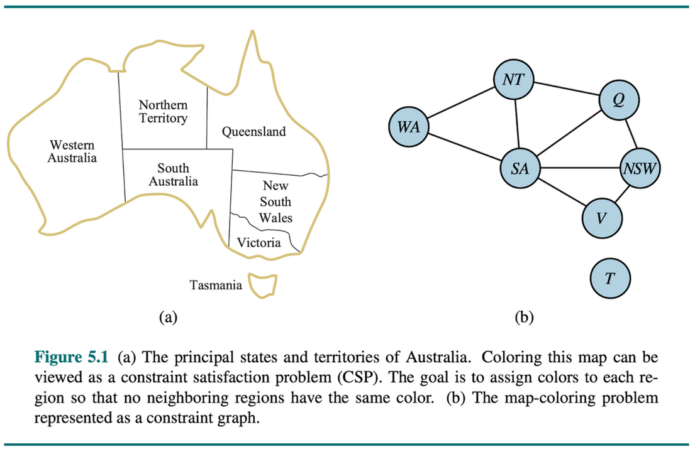
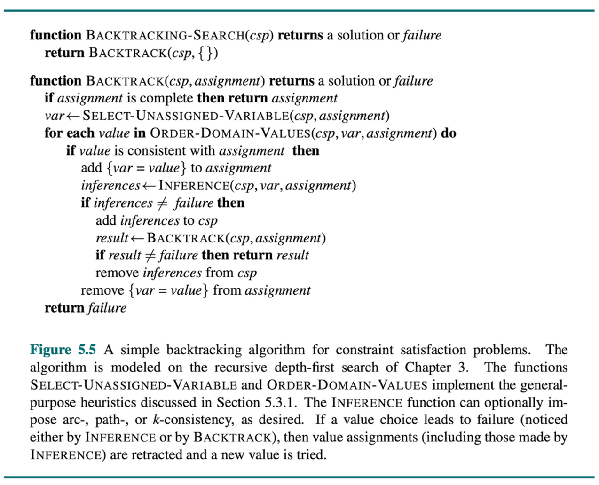

<!--
Week 6 Session A. Mini-lecture budget: 25 minutes.
Source: 02_Problem.pptx slides 23-25 (only three slides — most of this deck is
authored to fill the gap). Beats per lesson plan: representation change (5) →
formal definition (4) → backtracking (4) → inference (7) → ordering (5).
DUEL 1 IS COLLECTED THIS SESSION. Lesson plan: ../../weeks/week-06.md
-->

# Constraint Satisfaction Problems

## Opening the black box

**CMP-4004** · Week 6


---

# A change of representation


In standard search, states are **black boxes** — only reaching the goal matters.

In a CSP, states have **internal structure**: variables with values that must
satisfy constraints.

A CSP is solved when a **complete and consistent** assignment of values to all
variables is found.

### Why this matters

Structure enables **inference**. You can reason about a *partial* assignment —
which is impossible when states are atomic.

*This is the payoff of moving from atomic to factored representations (week 2).*

<!--
5 min. Connect back to week 2's atomic/factored/structured slide explicitly.
Weeks 3-5 were atomic. This week is factored. Weeks 8-9 are structured.
-->

---

# Two examples



## Sudoku

**Constraint** — numbers cannot repeat in any row, column, or 3×3 box.

## School schedule

**Constraint** — sports cannot be scheduled after lunch.

Both are the same object underneath: variables, domains, and restrictions on
combinations.

---

# Formal definition ⟨X, D, C⟩

| | |
|---|---|
| **Variables** | `X = {X₁, X₂, …, Xₙ}` — what must be assigned |
| **Domains** | `D = {D₁, D₂, …, Dₙ}` — possible values for each variable |
| **Constraints** | `C` — the conditions assignments must satisfy |

- A **consistent** assignment violates no constraints
- A **complete** assignment gives every variable a value
- A **solution** is complete **and** consistent

### One structural fact with a large consequence

CSPs are **commutative** in assignment order: the set of solutions does not depend
on the order you assign variables. **Therefore you may choose any order you
like — and choosing well is most of the win.**

<!--
4 min. The commutativity point is what licenses the ordering heuristics five
slides from now. State it here or MRV looks arbitrary later.
-->

---

# Backtracking search



Depth-first search over **partial** assignments, rejecting inconsistent ones
early.

```
function BACKTRACK(assignment, csp):
    if assignment is complete: return assignment
    var ← SELECT-UNASSIGNED-VARIABLE(csp, assignment)
    for each value in ORDER-DOMAIN-VALUES(var, assignment, csp):
        if value is consistent with assignment:
            add {var = value} to assignment
            result ← BACKTRACK(assignment, csp)
            if result ≠ failure: return result
            remove {var = value}
    return failure
```

**Contrast with generate-and-test:** backtracking checks at *every* assignment,
not at the end. That is the difference between 10⁷⁷ and tractable.

---

# Inference: shrink the domains before you search

## Forward checking

When you assign `X`, delete conflicting values from the domains of its
**unassigned neighbors**. Cheap. Catches failures **one step** early.

## Arc consistency / AC-3 (Mackworth 1977)

Propagate over a **queue of arcs to fixpoint**. An arc `(Xᵢ, Xⱼ)` is consistent
when every value in `Dᵢ` has *some* compatible value in `Dⱼ`.

Stronger — catches failures forward checking misses. It can prove
unsatisfiability **before search begins**.

> AC-3 is **not a solver.** It is a preprocessor and an in-search pruner. It
> usually leaves a search problem behind.

<!--
7 min. Show a map-coloring instance where forward checking sees NOTHING and AC-3
detects unsatisfiability immediately. That contrast is what justifies AC-3's
extra cost; without it students conclude forward checking is enough.
Note the local/global point from the paper: arc consistency is a LOCAL, pairwise
property that produces a GLOBAL reduction. Local propagation is cheap; global
consistency is not.
-->

---

# Ordering heuristics

| Heuristic | Rule | Why |
|---|---|---|
| **MRV** — minimum remaining values | assign the **most constrained** variable first | **fail fast** |
| **Degree** | tiebreak MRV by the variable in the **most constraints** | reduce future branching |
| **LCV** — least constraining value | try the value ruling out the **fewest** neighbor options | **succeed first** |

## The asymmetry

> **Variable ordering wants to fail fast. Value ordering wants to succeed first.**

Choosing a variable is choosing where to *discover* a dead end — do it as early
and cheaply as possible. Choosing a value is choosing which branch to *walk* —
walk the one most likely to work.

<!--
5 min. Students find the fail-fast/succeed-first inversion confusing until it is
said out loud in exactly those words. Say it.
-->

---

# The ablation table

Same Sudoku instance. Same search algorithm throughout.

| Configuration | Backtrack calls | Time |
|---|---|---|
| Plain backtracking | ~120,000 | 8.2 s |
| + forward checking | ~9,000 | 0.9 s |
| + MRV | ~400 | 0.05 s |
| + AC-3 preprocessing | **~60** | **0.02 s** |

**Three orders of magnitude from roughly 30 lines of code.**

> This is the *same* search algorithm. All of the gain came from **inference and
> ordering** — from thinking about the problem, not from more compute.

Students who internalize this understand why "just use a bigger model" is not
always the answer.

---

# Logic-LM: the architecture of the rest of the course


Pan et al. (2023). The pattern:

```
natural language
      │
      ▼  LLM  ← good at reading ambiguous text
formal specification (CSP / SAT / PDDL)
      │
      ▼  SYMBOLIC SOLVER  ← supplies the guarantee
answer
      │
      └── error? feed it back and re-translate  (self-refinement)
```

- The LLM does what it is genuinely good at: **reading ambiguous language**
- The solver does what it is genuinely good at: **executing a combinatorial
  procedure reliably**
- **The guarantee lives in the solver.** If the model is faithful, the answer is
  *provably* correct.

---

# The failure mode moves — and that is the point

| Architecture | Failure mode | Can you detect it? |
|---|---|---|
| End-to-end LLM | wrong answer | **no signal** |
| LLM + solver | **wrong model, correctly solved** | often **yes** — it won't parse, or the solver reports *unsatisfiable*, or you can read the model against the source text |

> ## An unreliable generator plus a sound verifier can be a reliable system.

This sentence is the thesis of this course. It appears again in weeks 7, 8, 9,
and in your capstone.

<!--
This is the pivotal slide of the semester. The studio has students build all
three arms (hand-modeled / hybrid / end-to-end) and the intended discovery is
exactly the right-hand column: arm B's failures are LOUD and arm C's are SILENT.
Do not give them that conclusion here — set it up and let the data deliver it.
Ask in the demos: "which arm would you rather deploy, and how would you know it
broke?"
-->

---

# Next

## Live coding — a CSP solver with a switchable ablation

## Studio — the three-arm experiment

| Arm | Pipeline |
|---|---|
| **A — Hand-modeled** | you write the CSP → your solver |
| **B — Hybrid** | LLM writes the CSP → your solver |
| **C — End-to-end** | LLM reads the puzzle and answers |

20 natural-language logic puzzles. Classify **every** arm-B failure:
malformed JSON · valid JSON but wrong model · over-constrained · timeout.

Then add the self-refinement loop and report the delta.

**Duel 1 is due today.**
