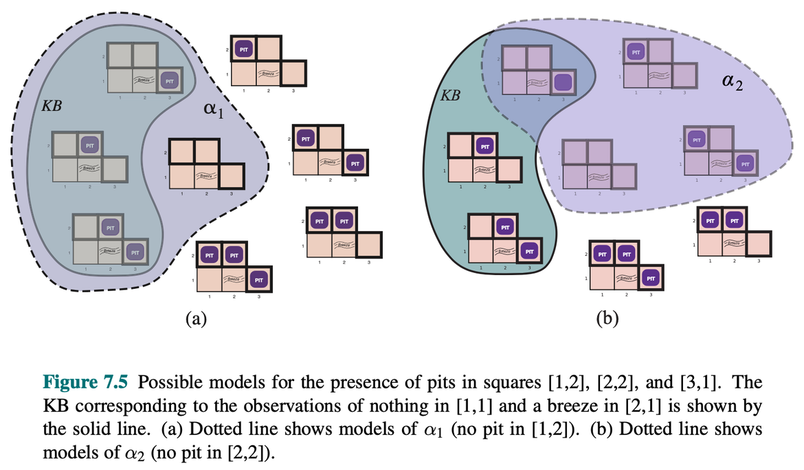
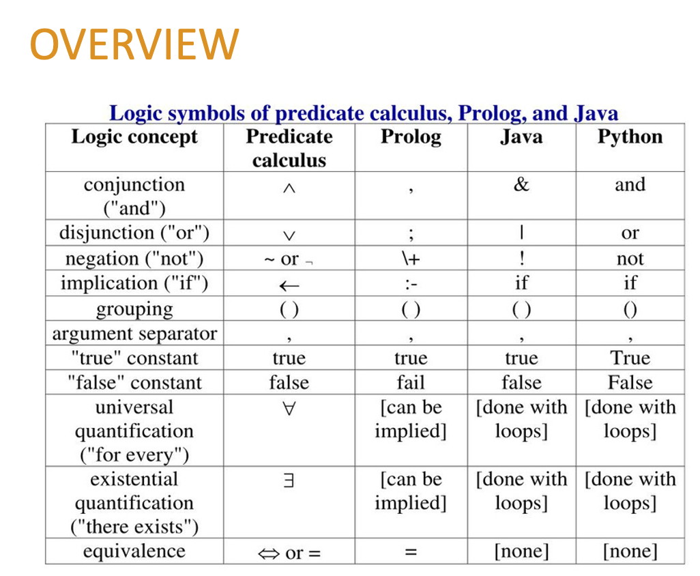
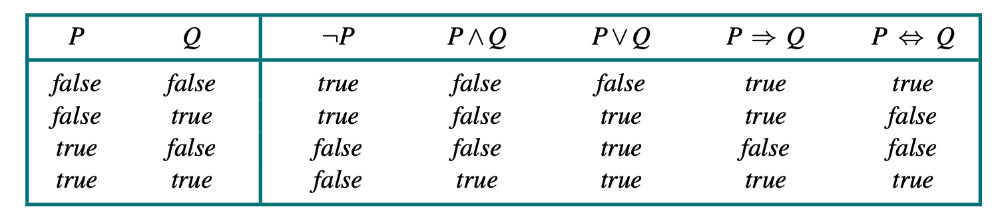
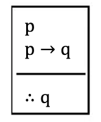
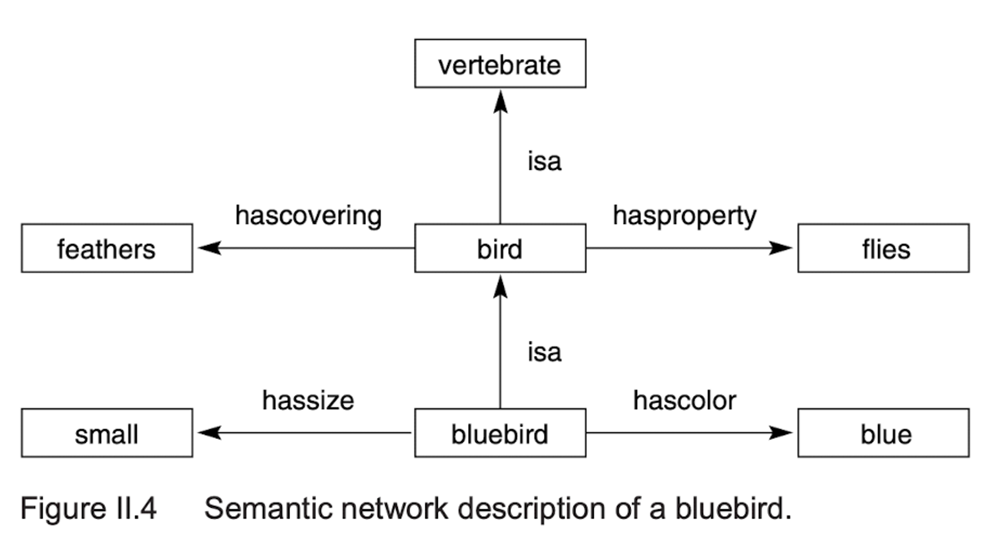

<!--
Week 7 Session A. Mini-lecture budget: 25 minutes.
Source: 05_Planning.pptx slides 1-9. Beats per lesson plan: KB agents (4) →
syntax/semantics (5) → the central identity (6) → inference rules (5) →
limitations (5). CHECKPOINT 1 IS THIS WEEK. Lesson plan: ../../weeks/week-07.md
-->

# Knowledge, Reasoning, and Planning

## Part 1 — Propositional logic and SAT

**CMP-4004** · Week 7


---

# Why logic?


## From search to knowledge

Search agents treat states as **black boxes**: they do not understand the world,
they only **navigate** through it.

A **logical agent** explicitly *represents* knowledge about the world and
**reasons** from it.

### The advantage

Knowledge is **reusable and generalizable** — one rule applies to infinitely many
concrete cases.

No lookup table has that property. No trained policy states which cases it covers.

---

# The knowledge base


A set of sentences the agent **knows to be true**, expressed in a formal language.

| Operation | Meaning |
|---|---|
| **TELL** | add new information to the KB |
| **ASK** | query whether something can be **derived** from the KB |

The agent runs a cycle: **perceive → TELL → ASK → act**

- **Inference** — the process of deriving new sentences from existing ones
- **Inference rule** — a mechanism guaranteeing the conclusion is true whenever
  the premises are

<!--
4 min for the two slides above. The contrast with weeks 3-6 is the payload:
a search agent NAVIGATES the world, a logical agent DESCRIBES it and derives
consequences.
-->

---

# The vocabulary — get this exactly right



| Term | Definition |
|---|---|
| **Model** | an assignment of truth values to **all** propositional variables — *"a possible way the world could be"* |
| **Satisfiable** | true in **at least one** model |
| **Unsatisfiable** | true in **no** model |
| **Valid** (tautology) | true in **every** model |
| **Entailment** `α ⊨ β` | β is true in **every** model in which α is true |

**Correct inference** guarantees that only *logical consequences* of the KB are
derived.

<!--
5 min. Students conflate these constantly and Checkpoint 2 tests exactly this
table. Drill it. Ask for the difference between "valid" and "satisfiable" until
someone gives it cleanly.
-->

---

# The central identity

# `KB ⊨ α`  iff  `KB ∧ ¬α` is **unsatisfiable**

### Why this is the most important equation in the unit

| Left side | Right side |
|---|---|
| a claim about **all** models | a **search** for one model |
| apparently requires surveying everything | a satisfiability check |
| not directly computable | **this is what a SAT solver does** |

Entailment becomes satisfiability. That conversion is what makes automated
reasoning possible — **and it is why a SAT solver is a general-purpose reasoning
engine**, not just a puzzle tool.

<!--
6 min. DERIVE IT, do not assert it. If beta is true in every model of alpha, then
no model makes alpha true and beta false, so alpha AND NOT-beta has no model.
Run both directions.
-->

---

# Propositional logic



- A **proposition** is a statement that can be true or false
- **Propositional symbols** represent facts about the world
- **Complex sentences** are built with logical connectives

`¬` `∧` `∨` `→` `↔`

That is the entire language. Its limits are the reason week 8 exists.

---

# Semantics and truth tables



**Semantics** defines when a sentence is true in a given **model**.
**Truth tables** enumerate all possible models.

## The row everyone resists: `P → Q`

| P | Q | P → Q |
|---|---|---|
| T | T | **T** |
| T | F | **F** |
| F | T | **T** |
| F | F | **T** |

It is false **only** when P is true and Q is false. If P is false, the implication
is true **regardless of Q**.

*"If the moon is cheese, I am the king of Spain"* — true.

<!--
Give the vacuous-truth example and MOVE ON QUICKLY. Arguing about material
implication burns five minutes and convinces nobody. It is a definition.
-->

---

# Inference rules



| Rule | Form |
|---|---|
| **Modus ponens** | `α → β`, `α`  ⟹  `β` |
| **Modus tollens** | `α → β`, `¬β`  ⟹  `¬α` |
| **And-elimination** | `α ∧ β`  ⟹  `α` |
| **Resolution** | `α ∨ β`, `¬β ∨ γ`  ⟹  `α ∨ γ` |

Each **preserves truth**: if the premises hold in a model, so does the conclusion.

### And the one that is *not* a rule

`α → β`, `β` ⟹ `α` — **affirming the consequent.** This is the warm-up poll, and
it is invalid.

<!--
5 min. Model checking by truth-table enumeration is sound and complete but
O(2^n) — name that cost, because DPLL in the live-coding block is the response
to it.
-->

---

# A note on the source deck: semantic networks



```
isa(bluebird, bird)        isa(bird, vertebrate)
hassize(bluebird, small)   hascovering(bird, feathers)
hascolor(bluebird, blue)   hasproperty(bird, flies)
```

Notice what it wants to say and cannot say here:

> *Everything that is a bird has feathers.*

Propositional logic cannot express that. You would need one sentence per bird.

**We come back to this exact KB in week 8** and write the inheritance rule in one
line of Prolog.

---

# Limitations of propositional logic


Propositional logic is **decidable** and has clear semantics. It is also **not
very expressive.** It cannot represent:

- **Objects and their properties** — no way to say "all pits cause a breeze"
  without enumerating every case
- **Relations between objects** — "John is Mary's father" needs a distinct
  proposition for every pair
- **Quantifiers** — "every animal has a heart" is inexpressible

With *n* objects and *k*-ary relations you need **O(nᵏ)** propositions.
**It does not scale.**

**Solution: First-Order Logic** — objects, relations, and quantifiers. *(Week 8.)*

<!--
5 min. Make it concrete with the Wumpus World: a 4x4 grid needs dozens of
propositions to say what FOL says in one line. The studio task has students feel
this by hand, so plant it here.
-->

---

# Next: live coding — DPLL (1962)

Backtracking search over assignments, with **unit propagation**:

- a clause with one unassigned literal leaves **no choice** → assign it
- this is week 6's **forward checking**, specialized to Boolean domains

Structurally the same as your CSP solver. Notice that.

## And the identity, in code

```python
def entails(kb_clauses, alpha_clauses):
    """KB ⊨ α  iff  KB ∧ ¬α is unsatisfiable."""
    return dpll(kb_clauses + negate_cnf(alpha_clauses)) is None
```

**Studio:** a Wumpus World agent that moves only to squares it can **prove** safe
— then the same percepts given to an LLM, scored on **soundness**, not accuracy.

<!--
On the Wumpus KB, the counter shows most variables get assigned by propagation
with almost no branching. Same lesson as week 6: INFERENCE BEATS SEARCH.
The honest boundary to flag in the studio: logic tells you what follows, not what
to do when nothing follows. That is the motivation for week 12.
CHECKPOINT 1 THIS WEEK — covers weeks 1-6.
-->
